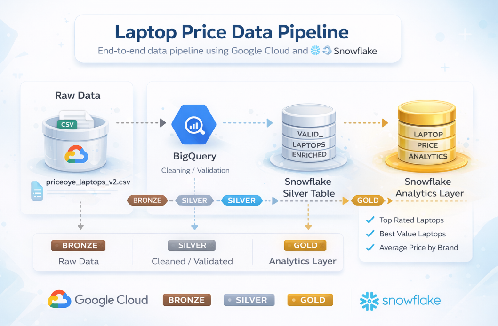

# Laptop Price Data Pipeline

## Project Overview

This project builds an end-to-end data engineering pipeline to analyze laptop pricing data and generate insights such as top-rated laptops, best value deals, and average prices by brand.

The goal of this project is to demonstrate a modern data pipeline architecture using cloud storage, data warehousing, and layered data modeling (Bronze → Silver → Gold).

The pipeline processes raw laptop pricing data, cleans and validates it, enriches it with derived metrics, and prepares an analytics-ready dataset for business queries.

---

# Problem Statement

Online electronics marketplaces contain large amounts of laptop pricing data. However, raw datasets often contain:

- Missing values
- Inconsistent formats
- Duplicate records
- Irrelevant entries
- Limited analytical structure

These issues make it difficult for analysts to extract insights directly from raw data.

The objective of this project was to design a structured data pipeline that transforms raw laptop pricing data into a clean, analytics-ready dataset.

---

# Dataset

Source: Laptop pricing data scraped from PriceOye.

File used:

```
priceoye_laptops_version_2.csv
```

The dataset includes attributes such as:

- Brand
- Model
- Original Price
- Discounted Price
- Rating
- Number of Reviews
- CPU
- SSD Size

---

# Architecture

The pipeline follows a **Medallion Architecture** pattern.

```
Raw Data → Cloud Storage → BigQuery → Snowflake → Analytics Layer
```

Pipeline layers:

| Layer | Purpose |
|------|--------|
| **Bronze** | Raw ingestion of laptop data |
| **Silver** | Data cleaning and validation |
| **Gold** | Analytics-ready aggregated dataset |

---

# Pipeline Workflow

## 1. Raw Data Ingestion (Bronze Layer)

The raw CSV dataset is uploaded to **Google Cloud Storage (GCS)**.  
This acts as the initial storage layer for unprocessed data.

```
GCS Bucket
laptop-raw-data-sathwika
```

---

## 2. Data Cleaning & Validation (Silver Layer)

Data is processed using **BigQuery** where cleaning and validation logic is applied:

Key transformations include:

- Removing invalid rows
- Handling missing values
- Standardizing column formats
- Filtering unrealistic prices
- Ensuring valid SSD and CPU values

This produces a **cleaned dataset ready for analytics processing**.

Example tables created:

```
cleaned_laptops
valid_laptops
valid_laptops_v2
```

---

## 3. Data Warehouse Modeling (Snowflake)

Cleaned data is exported from BigQuery and loaded into **Snowflake**.

A layered warehouse structure is implemented:

```
LAPTOP_PIPELINE_DB
│
├── BRONZE
├── SILVER
└── GOLD
```

### Silver Layer

```
VALID_LAPTOPS_ENRICHED
```

This table enriches the dataset with calculated fields such as:

- Price savings
- Discount percentages
- Valid hardware specifications

---

### Gold Layer

```
LAPTOP_PRICE_ANALYTICS
```

This table contains analytics-ready data for business queries.

---

# Example Analytics Queries

### Top Rated Laptops

```sql
SELECT *
FROM GOLD.LAPTOP_PRICE_ANALYTICS
ORDER BY RATING DESC
LIMIT 10;
```

---

### Best Value Laptops

```sql
SELECT *
FROM GOLD.LAPTOP_PRICE_ANALYTICS
ORDER BY SAVING_PERCENT DESC
LIMIT 10;
```

---

### Average Price by Brand

```sql
SELECT
    BRAND,
    AVG(DISCOUNTED_PRICE) AS AVG_PRICE
FROM GOLD.LAPTOP_PRICE_ANALYTICS
GROUP BY BRAND
ORDER BY AVG_PRICE DESC;
```

---

# Technologies Used

| Tool | Purpose |
|----|----|
| Google Cloud Storage | Raw data storage |
| BigQuery | Data cleaning and transformation |
| Snowflake | Data warehouse |
| SQL | Data modeling and analytics |

---

# Project Architecture



---

# Key Outcomes

- Built a full **end-to-end data pipeline**
- Implemented **Medallion Architecture**
- Transformed raw data into **analytics-ready datasets**
- Enabled meaningful pricing insights for laptops

---

# Author

**Sathwika Rupireddy**
MS Data Analytics  
Webster University
